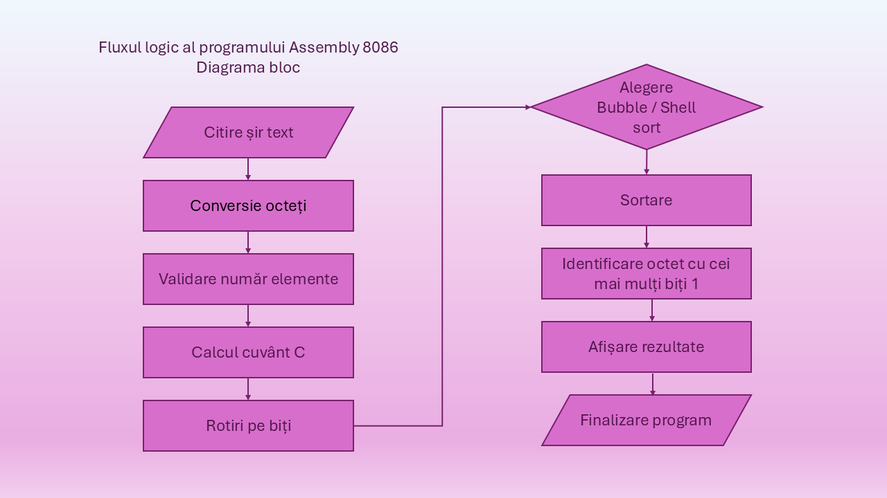

**Prelucrarea și Analiza unui Șir de Octeți în Assembly 8086**

**Descriere generală**

Acest proiect implementează un program complet funcțional în limbaj de asamblare 8086, capabil să prelucreze un șir de octeți introduși în format hexazecimal. Programul integrează operații pe biți, conversii numerice, două metode de sortare, analiză asupra structurii octeților și afișare formatată. Structura modulară permite extinderea și întreținerea facilă a codului.

**Obiectivele proiectului**

* Citirea și validarea unui șir de 8–16 octeți în format hexazecimal
* Conversia sirului hex în valori binare reale
* Calculul unui cuvânt de 16 biți pe baza operațiilor pe biți
* Aplicarea de rotiri logice asupra fiecărui octet
* Sortarea șirului folosind două metode diferite
* Identificarea octetului cu cei mai mulți biți setați la 1
* Afișarea rezultatelor într-un format clar și structurat

**Arhitectura programului**

Programul este împărțit în patru module principale, fiecare implementat prin proceduri independente.

**1. Student 1 - Modulul de citire și conversie**
   
Responsabilități:

- citirea inputului utilizatorului folosind bufferul DOS

- eliminarea spațiilor și a caracterelor invalide

- conversia fiecărei perechi de cifre hex în octeți

- validarea numărului de octeți (minim 8, maxim 16)

Acest modul asigură integritatea datelor înainte de procesare.

**2. Student 2 – Operații pe biți**
   
**2.1 Calculul cuvântului C (16 biți)**
   
Cuvântul C este construit din trei componente:

- Biții 0–3: XOR între nibble-ul inferior al primului octet și nibble-ul superior al ultimului octet

- Biții 4–7: OR între nibble-urile obținute prin deplasarea fiecărui octet cu 2 biți la dreapta

- Biții 8–15: suma tuturor octeților modulo 256

Rezultatul este afișat în hexazecimal.

**2.2 Rotirea fiecărui octet**

Pentru fiecare octet se calculează:

- N = bit0 + bit1

- se aplică o rotire la stânga cu N poziții

- se afișează rezultatul în hex și binar

Acest modul demonstrează utilizarea operațiilor logice și aritmetice pe biți.

**3. Student 3 – Sortare și analiză**
   
**3.1 Sortarea descrescătoare (Bubble Sort)**
   
Metoda implicită de sortare:

- compară elemente consecutive
- le interschimbă dacă sunt în ordine greșită
- se oprește devreme dacă nu au avut loc schimbări

**3.2 Identificarea octetului cu cei mai mulți biți de 1**

Programul:

* numără biții setați pentru fiecare octet
* ignoră octeții cu ≤ 3 biți de 1
* selectează octetul cu numărul maxim de biți 1
* afișează poziția și valoarea acestuia

**4. Student 4 – Metodă alternativă de sortare (Shell Sort)**
   
Pe lângă sortarea implicită, proiectul include o metodă alternativă - Shell Sort (descrescător):
- mai eficient decât Bubble Sort
- nu folosește recursivitate
- ideal pentru vectori mici (8–16 elemente)
- utilizează o secvență descrescătoare de „gap”-uri pentru optimizarea comparațiilor

**Selectarea metodei de sortare**

Programul permite alegerea metodei printr-o variabilă internă:

- 0 → Bubble Sort (implicit)
- 1 → Shell Sort

Această flexibilitate demonstrează extensibilitatea și modularitatea proiectului.

**Fluxul complet al execuției**

* Citirea șirului de octeți în format hex
* Conversia în octeți reali
* Validarea numărului de elemente
* Calculul cuvântului C
* Aplicarea rotirilor pe biți
* Selectarea metodei de sortare
* Sortarea șirului
* Afișarea șirului sortat
* Identificarea octetului cu cei mai mulți biți 1
* Afișarea poziției și valorii acestuia
* Finalizarea programului

**Funcționalități auxiliare**

Programul include proceduri dedicate pentru:

* afișarea unui octet în hexazecimal
* afișarea unui octet în binar
* afișarea unui cuvânt (16 biți) în hex
* afișarea unui șir terminat cu caracterul $
* afișarea unui newline
* afișarea poziției în zecimal
* numărarea biților de 1

Aceste proceduri contribuie la claritatea și modularitatea codului.

**Probleme întâmpinate**

**Student 1:** înțelegerea modului de citire a datelor folosind bufferul DOS și tratarea corectă a cazurilor de input greșit în Assembly.În plus, lucrul cu Git Bash a fost o provocare la început,mai ales salvarea modificărilor.
**Student 2:** Calculul eficient al sumei modulo 256.
O provocare a fost implementarea sumei tuturor octeților „modulo 256” fără a complica codul cu instrucțiuni de împărțire (DIV) am folosit o soluție simplă direct din regiștri. Am adunat totul, iar la final am păstrat doar octetul AL (un octet ține maxim 255, orice depășire se elimină automat, așa că am obținut restul împărțirii direct)
**Student 3:** Implementarea algoritmului Bubble sort a fost o provocare din cauza gestionării fluxului de date și a operațiilor de comparare la nivel de octet, iar conversiile între reprezentări numerice au fost mai dificile de asemenea, implicând manipulări precise la nivel de biți și transformări aritmetice pentru generarea corectă a formatelor de ieșire cerute.
**Student 4:** Provocarea pentru shell sort a fost gestionarea corectă a indexării cu gap-uri variabile, specifică algoritmului Shell Sort, pentru că spre deosebire de sortările simple, Shell Sort presupune accesarea elementelor aflate la distanțe mari între ele, iar în Assembly acest lucru necesită o atenție deosebită pentru a evita ieșirea din limitele vectorului. 
